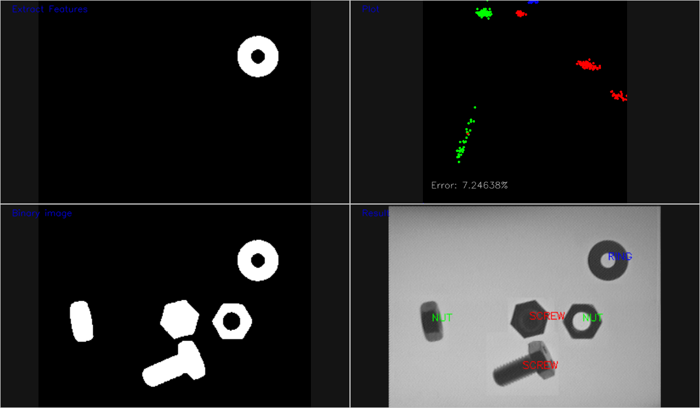
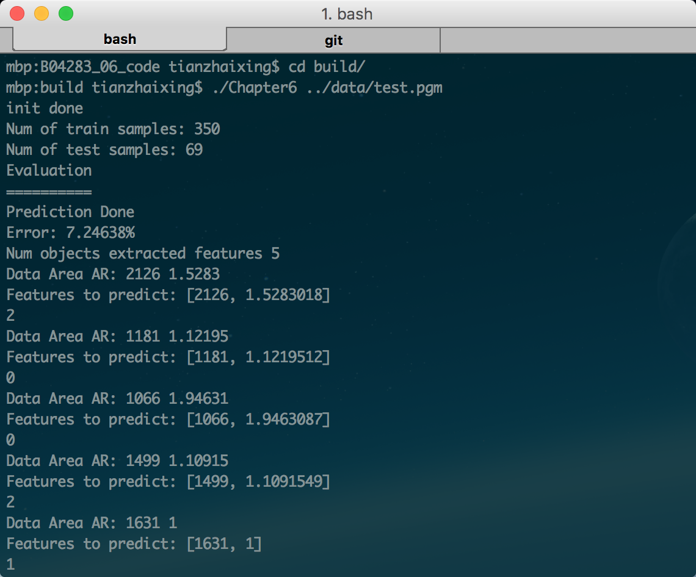

Steps to build
==============

    $ tar -zxvf data.tar.gz
    $ make a build folder
    $ cd build
    $ cmake ..
    $ make

Executables
===========

    ./Chapter6 ../data/test.pgm

Results
===========

 Note
> Source code mainly comes from **OpenCV By Example** book.  
> I only add and change a little code so that the demo can run without any error.
